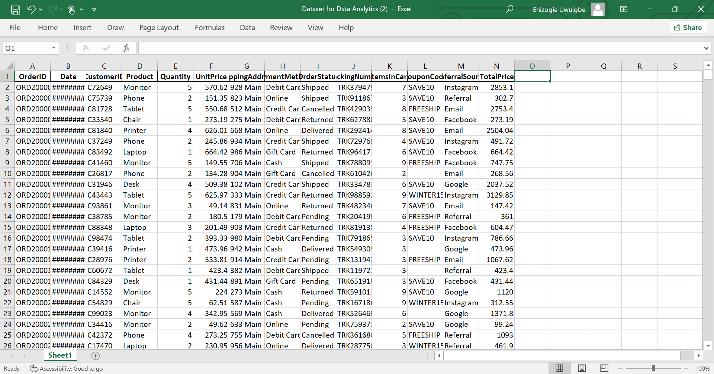
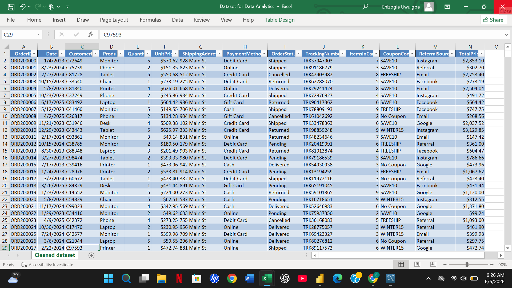

Decode Labs Project 1: Decode-labs-data-cleaning-and-preparation
## Project Overview
This project focuses on cleaning and preparing an e-commerce transaction dataset for analysis. The objective were set to improve data quality, identify inconsistencies, handle missing values, and ensure the dataset was suitable for exploratory data analysis (EDA) and SQL-based business analysis.
---
## Dataset Description
The dataset contains 1,200 transaction records with the following fields:
- OrderID
- Date
- CustomerID
- Product
- Quantity
- UnitPrice
- ShippingAddress
- PaymentMethod
- OrderStatus
- TrackingNumber
- ItemsIncart
- CouponCode
- referralSource
- TotalPrice
  
The dataset was reviewed to identify potential data quality issues that could affect subsequent analysis.
---
## Data Cleaning Process
### 1. Missing VAlue Assessment
A review of the dataset was conducted to identify missing values.
#### Findings
- Blank values were identified in the `CouponCode` column.
- The blank entries represented transactions where customers did not use any promotional coupon.
#### Action Taken
- Missing values in the `CouponCode` column were replaced with:
``` TExt
No Coupon Code
```
This ensured consistency and prevented missing values from affecting subsequent analysis.
### 2. Duplicate Check
The dataset was inspected for duplicate records.
#### Action Taken
- Checked for duplicate transactions using OrderID and transaction records.
- No duplicate records were identified.

  ---

  ### 3. Data Type Validation
  The dataset was reviewed to ensure all fields were stored in appropriate formats.

  #### Validation Performed

| Column | Data Type |
|----------|----------|
| Date | Date |
| Quantity | Numeric |
| UnitPrice | Numeric |
| ItemsInCart | Numeric |
| TotalPrice | Numeric |
| Product | Text |
| PaymentMethod | Text |
| CouponCode | Text |

---

### 4. Data Consistency 

Categorical columns were reviewed for consistency.

The following fields were inspected:

- Product
- PaymentMethod
- OrderStatus
- CouponCode
- ReferralSource

No major inconsistencies were identified.

---

### 4. Dataset Validation

A final review was conducted to ensure:

- No unresolved missing values remained.
- Records were complete and consistent.
- The dataset was ready for analysis.

  ---

  ## Cleaning Summary

| Data Quality Check | Status |
|-------------------|--------|
| Missing Values | Completed |
| Duplicate Check | Completed |
| Data Type Validation | Completed |
| Consistency Review | Completed |
| Dataset Validation | Completed |

## Dataset Files

- [Raw Dataset](Raw_dataset.xlsx)
- [Cleaned Dataset](Cleaned_dataset.xlsx)

## Dataset Preview

### Raw Dataset Preview



### Cleaned Dataset Preview




